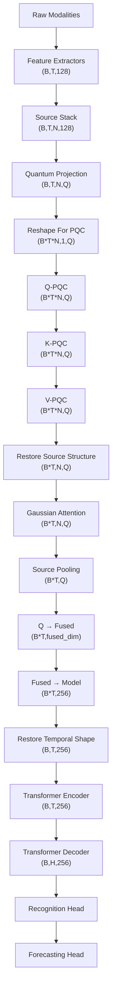

# QSAL Runtime Architecture

Generated automatically from runtime execution.

```mermaid
flowchart TD

N0["Raw Modalities"]
N1["Feature Extractors<br/>(B,T,128)"]
N2["Source Stack<br/>(B,T,N,128)"]
N3["Quantum Projection<br/>(B,T,N,Q)"]
N4["Reshape For PQC<br/>(B*T*N,1,Q)"]
N5["Q-PQC<br/>(B*T*N,Q)"]
N6["K-PQC<br/>(B*T*N,Q)"]
N7["V-PQC<br/>(B*T*N,Q)"]
N8["Restore Source Structure<br/>(B*T,N,Q)"]
N9["Gaussian Attention<br/>(B*T,N,Q)"]
N10["Source Pooling<br/>(B*T,Q)"]
N11["Q → Fused<br/>(B*T,fused_dim)"]
N12["Fused → Model<br/>(B*T,256)"]
N13["Restore Temporal Shape<br/>(B,T,256)"]
N14["Transformer Encoder<br/>(B,T,256)"]
N15["Transformer Decoder<br/>(B,H,256)"]
N16["Recognition Head"]
N17["Forecasting Head"]

N0 --> N1
N1 --> N2
N2 --> N3
N3 --> N4
N4 --> N5
N5 --> N6
N6 --> N7
N7 --> N8
N8 --> N9
N9 --> N10
N10 --> N11
N11 --> N12
N12 --> N13
N13 --> N14
N14 --> N15
N15 --> N16
N16 --> N17
```